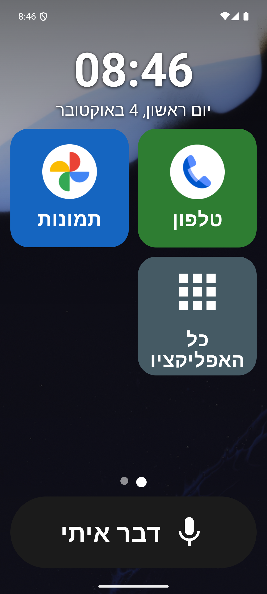
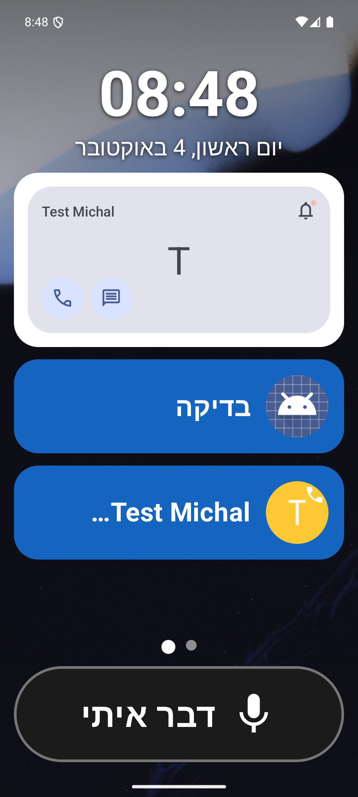
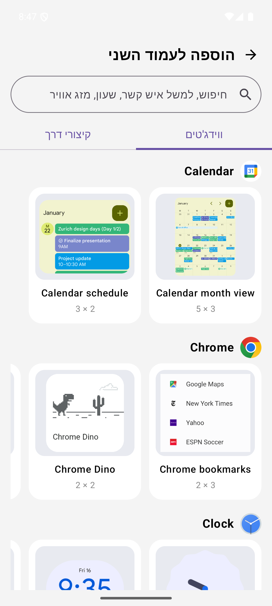
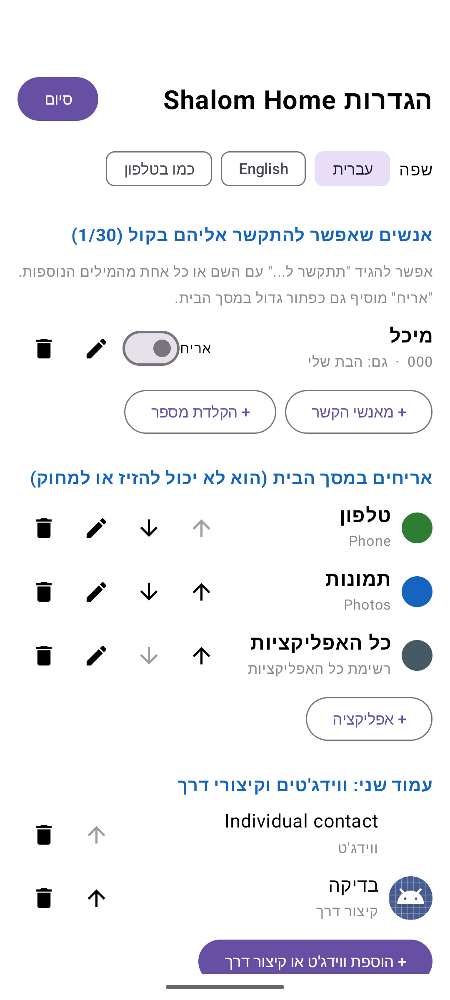

# Shalom Home

A home screen for my grandfather Shalom's Android phone.

He kept calling me because a shortcut had moved to another page, or because the button that calls my mom had disappeared. Shalom Home replaces his launcher with one page of big tiles he cannot drag, delete or swipe away, plus a "דבר איתי" ("talk to me") button: he says what he wants in Hebrew or French, and the phone does it.

All speech recognition and understanding runs on the phone with open-weight models. His voice and his contacts never leave the device, and nothing needs an internet connection after setup.

| Home | Second page | Widget picker | Setup (Hebrew) |
|---|---|---|---|
|  |  |  |  |

## How it works

```
mic -> Whisper (whisper.cpp, on device) -> transcript
    -> fuzzy Hebrew keyword match on contacts, tiles, apps   (instant)
    -> if unclear: Gemma 3 1B (llama.cpp, on device), output grammar-constrained to the option ids
    -> 3-second spoken countdown with a big cancel button -> call / open app
```

- **Whisper** (`ggml-small-q5_1`, 190MB) transcribes. The decoder is primed with the names of his contacts, which noticeably improves short commands like a single name.
- **Keyword matching** handles Hebrew prefixes (ל, ה, ו...), final letters, spelling variants (אמא / אימא) and small recognition errors.
- **Gemma 3 1B** (Q4_K_M, 800MB) handles requests with no keyword, like "I want to talk to my daughter". A GBNF grammar restricts its answer to the ids of his own contacts and tiles, or `none`, so it cannot invent a number or an action.
- Every voice action shows a countdown and can be cancelled. Only a real tap or a confirmed voice request can place a call.

## For the caregiver

- **Setup** opens with 5 quick taps on the clock, then a PIN. The first visit forces you to replace the default PIN. Three wrong PINs lock the pad for a minute (longer each time).
- **Voice contacts:** up to 30 people, each with the name he uses and other words he says for them ("הבת שלי", "ma fille"). Any of them can also get a tile.
- **Tiles:** apps and contacts, reorderable only from setup.
- **Second page:** widgets (e.g. Contacts "Direct dial") and pinned shortcuts. "Add to Home screen" requests from other apps wait in setup until you approve them.
- **Models** download once from Hugging Face inside setup.

## Build

Requires the Android SDK, NDK 28 and CMake 4.1 (from the SDK manager).

```
git clone --recurse-submodules https://github.com/RoeeIlouz/shalom-home
cd shalom-home
./gradlew assembleRelease   # APKs land in app/build/outputs/apk/release/, one per CPU type
```

whisper.cpp and llama.cpp are git submodules under `third_party/`, pinned to the versions this was built and tested with.

whisper.cpp and llama.cpp each link their own static copy of ggml into a separate JNI library with hidden symbols, so the two never clash in one process.

## Open models used

| Model | License | Role |
|---|---|---|
| [whisper.cpp ggml-small-q5_1](https://huggingface.co/ggerganov/whisper.cpp) | MIT | Speech to text |
| [Gemma 3 1B IT GGUF](https://huggingface.co/unsloth/gemma-3-1b-it-GGUF) | Gemma Terms of Use | Understanding requests |
| [ivrit.ai whisper-large-v3-turbo](https://huggingface.co/ivrit-ai/whisper-large-v3-turbo-ggml) | Apache-2.0 | Optional Hebrew fine-tune (larger, slower) |
